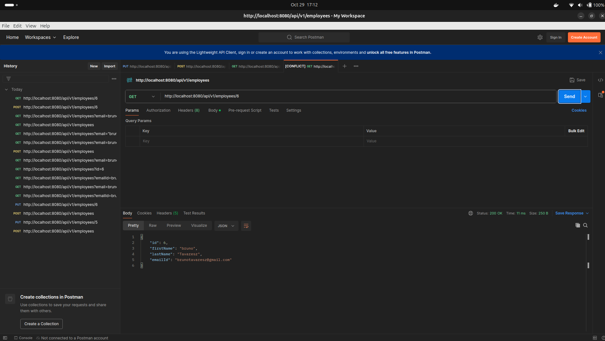

#  mysql in docker

```bash
docker run --name mysql5 -e MYSQL_ROOT_PASSWORD=secret1 -e MYSQL_DATABASE=demo -e MYSQL_USER=demo -e MYSQL_PASSWORD=secret2 -p 33060:3306 -d mysql/mysql-server:5.7
```

# Create project

Spring Initializr was used, using the following starter dependencies:

* Spring Web
* Spring Data JPA
* MySQL Driver
* DevTools
* Validation

# Structure of the project

* Employee - entity class 
* EmployeeRepository - repository interface
* EmployeeController - controller class

# Run project

```bash
mvn spring-boot:run
```

# Additional informations
Screenchots:




