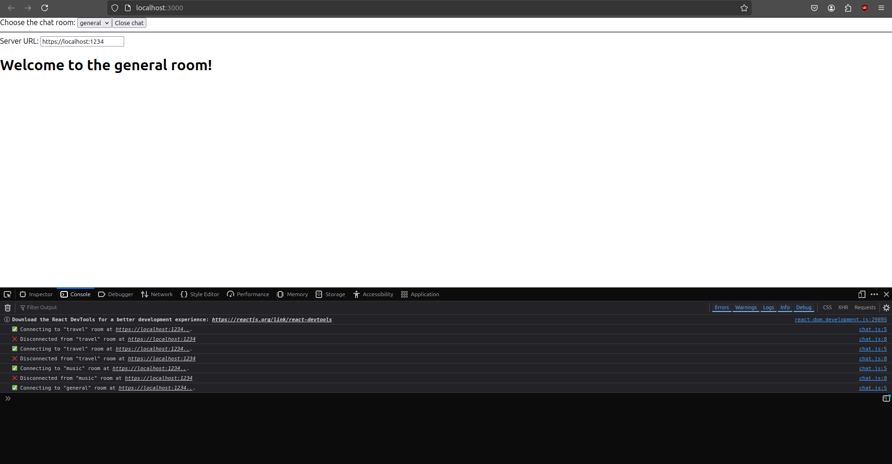
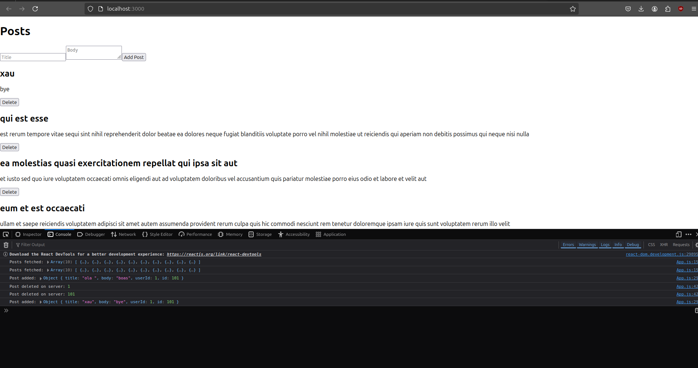

 # IES_Individual

 ## Ex1

 ```bash
 npx create-react-app my-app
 cd my-app
 npm start
 ```

 I did this to create my first React project, and then followed the intended guide.

 ### Topics of the first exercise:

 - How to create and nest components
 - How to add markup and styles
 - How to display data
 - How to render conditions and lists
 - How to respond to events and update the screen
 - How to share data between components

 ## Ex2

 ### Topics:

 - How to pass props to a component
 - How to read props from a component
 - How to specify default values for props
 - How to pass JSX to a component
 - How props change over time

 ```jsx
 <Card>
   <Avatar
     ...
   />
 </Card>
 ```

 ```jsx
 export default function Avatar({ person, size }) 
 ```

 ```jsx
 export default function Card({ children }) {
   return (
     <div className="card">
       {children}
     </div>
   );
 }
 ```

 ## Ex2b

 ### Topics:

 - How to correctly update an object in React state
 - How to update a nested object without mutating it
 - What immutability is and how not to break it
 - How to make object copying less repetitive with Immer

 #### Important commands:

 - Run `npm install use-immer` to add Immer as a dependency.
 - Replace `import { useState } from 'react'` with `import { useImmer } from 'use-immer'`.

 ## Ex2c

 ### Topics:

 - How to replace repetitive prop passing with context
 - Common use cases for context
 - Common alternatives to context

 ### Creating the Context:

 I created the `LevelContext` with an initial value of `0`.

 ```jsx
 export const LevelContext = createContext(0);
 ```

 ### Using the Context in the `Heading` Component:

 In the `Heading` component, I replaced the `level` prop with the value from the context using the `useContext` hook.

 ```jsx
 const level = useContext(LevelContext);
 ```

 ### Providing the Context in the `Section` Component:

 The `Section` component passes the level value to its child components through `LevelContext.Provider`.

 ```jsx
 <LevelContext.Provider value={level}>
   {children}
 </LevelContext.Provider>
 ```

 ## Ex2d

 I followed the tutorial from start to finish for the (3x3) grid and then adapted it to the 6x6 grid. I had to update the win conditions and also added a button to reset the game.

 ## Ex3a

 ### `App` Component:

 - Manages the chat room state (`roomId`) and displays the chat with an option to open or close it.
 - Uses a `select` to allow the user to choose the chat room and a button to toggle the chat visibility.

 ### `ChatRoom` Component (inside `App.js`):

 - Receives the `roomId` and server URL to connect to the chat room.
 - Uses `useEffect` to manage the connection and disconnection from the server when the `roomId` or `serverUrl` changes.

 ### `createConnection` Function:

 Simulates creating a connection to the server, logging connection and disconnection in the console.

 We can check it in *inspect* and then in the console:


 ## Ex3b

 ### Code Structure

 - States: `posts`, `title`, `body`.
 - `useEffect`: Fetches posts when the component is loaded.
 - Functions:
   - `addPostAxios`: Sends a new post via `POST`.
   - `deletePost`: Deletes a post via `DELETE`.

 ### Axios Requests

 - Fetch Posts (GET):

 ```js
 axios.get("https://jsonplaceholder.typicode.com/posts?_limit=10")
 ```

 - Add Post (POST):

 ```js
 axios.post("https://jsonplaceholder.typicode.com/posts", { title, body, userId: 1 })
 ```

 - Delete Post (DELETE):

 ```js
 axios.delete(`https://jsonplaceholder.typicode.com/posts/${id}`)
 ```



 ## Ex4a

 ```js
  docker compose up
 ```

 ```js
const client = axios.create({
    baseURL: 'http://localhost:8080/movies/save',
});
 ```


 ```js
 const response = await axios.post(`http://localhost:8080/quotes/save/$){selectedMovieId}`
 ```
 ### `App.js`:

 The main component that renders the movie and quote lists.

 ### Dockerfile

```js
FROM maven:3.9.9
WORKDIR /demo
COPY . .
CMD ./mvnw spring-boot:run 
```

```js
FROM node:18-alpine as build

WORKDIR /app

COPY package*.json ./

RUN npm install

COPY . .

RUN npm run build

FROM nginx:alpine

COPY --from=build /app/build /usr/share/nginx/html

EXPOSE 80

CMD ["nginx", "-g", "daemon off;"]
```

(I do this exercise with a help of a friend)