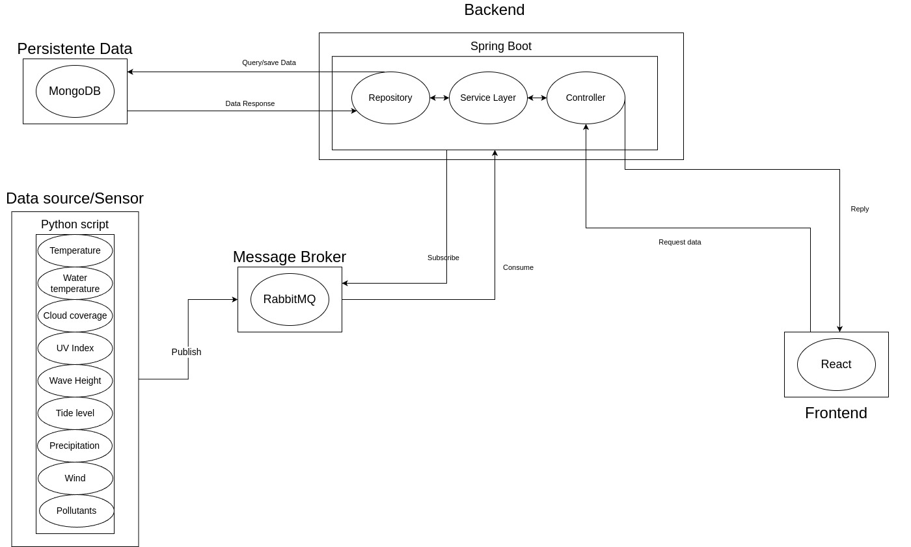
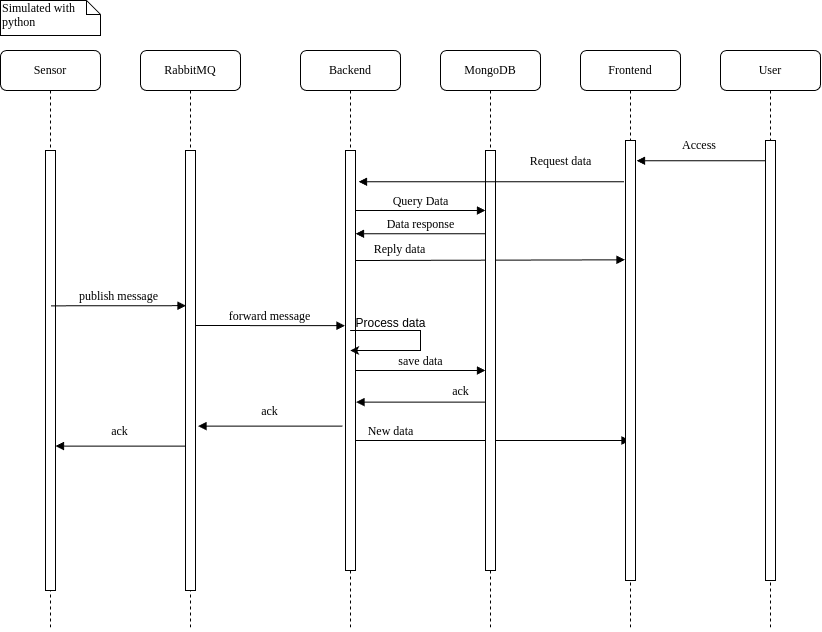
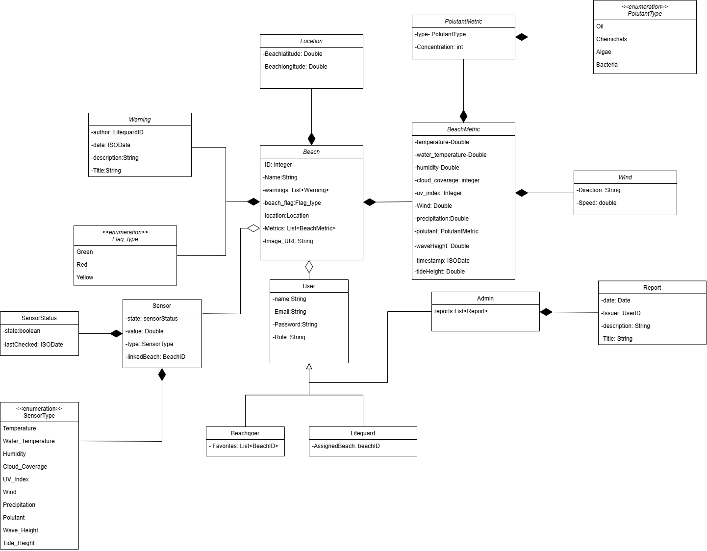

# BeachControl

## Project Abstract
- Our product focus on getting data of a public beach, such as : Water temperature, existence of pollutants, wind direction and speed, waves height, tide, temperature, precipitation(mm/h), cloud cover (%), indice UV. Providing a web interface to the user to access this data.


## Key Features:

- Real-time beach warnings

- Error Report

- Real-time beach metrics

## Project Team
| NMec   | Name            | Email                    | Roles            | GitHub       |
|--------|------------------|-------------------------|------------------|--------------|
| 113962 | André Alves     | aaalves@ua.pt            | Architect        | [GitHub](https://github.com/Xxerd) |
| 113372 | Bruno Tavares   | brunotavaresmeixedo@ua.pt| DevOps Master    | [GitHub](https://github.com/brunotavaresz) |
| 113763 | Francisco Pinto | francisco.g.pinto@ua.pt  | Team Manager     | [GitHub](https://github.com/MinolePato) |
| 112714 | Diogo Costa     | dmcosta03@ua.pt          | Product Owner    | [GitHub](https://github.com/costinha03) |


## Architecture



## Data Flux



## Database




# Development


## Directory Struture
### .github :
- Templates for issues and pull requests, along with the workflow for deploying the project to the server.
### Minutes : 
- A directory with summaries of the meetings the group had regarding the project's development.

### ProjAPI :

- Backend implementation of the project developed in Java, utilizing Spring and Maven.

### ProDataGen :

- Group of funtions to simulate beach conditions developed in python.
- Communication with backend is handled using RabbitMQ.

### ProjFrontend :

- Frontend implementation of the project developed with React ,and using libraries Flowbite, Tostify and ReCharts. 
- Communication with the backend is handled using Axios.

### Reports :

- Documentation of the project divided into its different iterations.

## Branchs

- `master`:This branch contains the latest stable version of the project and reports.

- `dev`:This branch contains the most recent version of the project.

### Branch structure

- ```<label>/<Developmentcomponent>/<IssueRelatedToTheComponent>``` 

## Documentation 

### API Swagger

- http://localhost:8080/swagger-ui.html
- http://192.168.160.227:8080/swagger-ui/index.html

### Project Report(latest)

- [Report](Reports/I5/IES%20Project%20Specification%20Report-group_403(final).pdf)


Database terminal:
```bash
docker exec -it mongodb mongosh --username admin --password example --authenticationDatabase admin
```


# Project Setup Guide

## Running the Project

### Local Development

#### Prerequisites
Before starting the project locally, ensure you have:
- MongoDB installed
- Docker and Docker Compose installed

#### Installation Steps

1. Start the MongoDB service:
```bash
sudo systemctl start mongod
```

2. Launch the application using Docker Compose:
```bash
docker compose up
```

3. Accessing the Application
- http://localhost:80 

### VPS Deployment

#### Accessing the Application
The application is deployed on the UA network and can be accessed at:
- Main Application: http://192.168.160.227/

#### Admin Access
To access the admin panel:


- Use the following credentials:
   - Email: admin@example.com
   - Password: adminpassword

#### Network Requirements
- Must be connected to the UA network to access the application
- VPN may be required if accessing from outside the network

## Support
If you encounter any issues during setup or deployment, please contact the system team.

### RabbitMq
```
# latest RabbitMQ 4.0.x
docker run -it --rm --name rabbitmq -p 5672:5672 -p 15672:15672 -e RABBITMQ_DEFAULT_USER=myuser -e RABBITMQ_DEFAULT_PASS=secret rabbitmq:4.0-management
```
